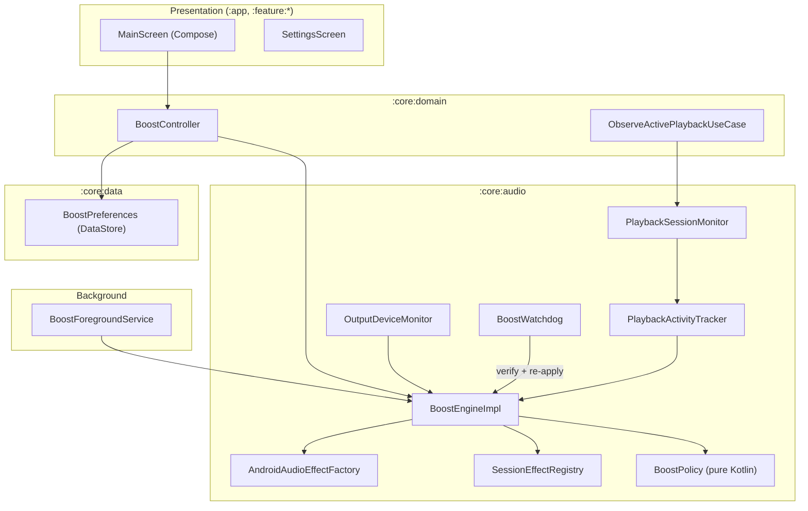
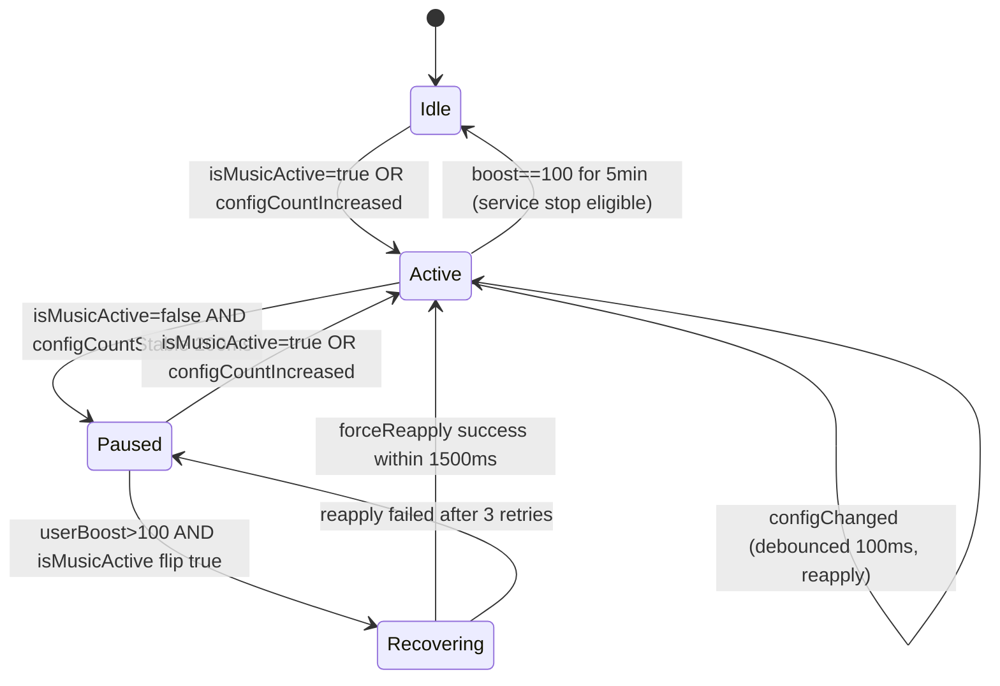
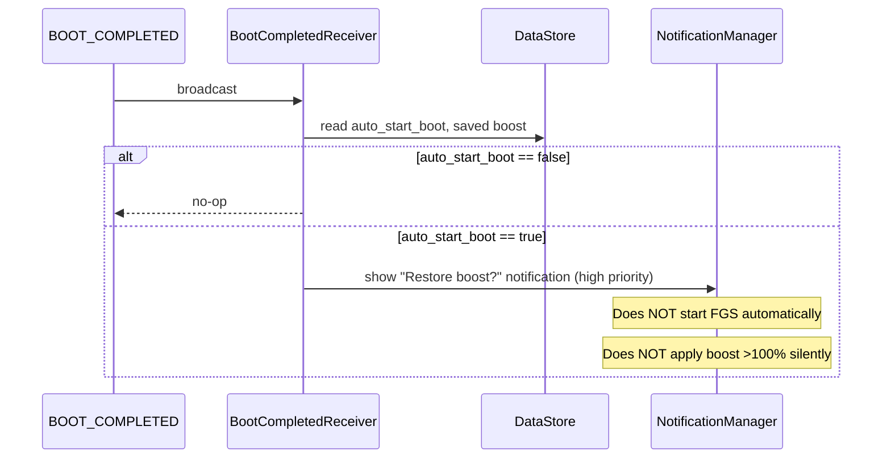

# DeciBoost — System Design Document

| Field | Value |
|-------|-------|
| **Author** | Artur Ayvazyan ([@ayv4zyan](https://github.com/ayv4zyan)) |
| **Date** | 2026-06-25 |
| **Status** | Implemented / Current (v0.1.4 alpha — PRs 1–11 complete) |
| **Target platform** | Android 16 (API 36) primary; backward compatible to API 26 |

---

## Overview

DeciBoost is a greenfield Android application that boosts media playback volume above the system 100% cap. The product differentiator is **session-lifecycle-aware boosting**: unlike BoostX (which attaches `LoudnessEnhancer(0)` once and releases effects when the Activity is destroyed), DeciBoost keeps a foreground audio engine alive and **re-applies boost deterministically whenever playback sessions change state**—including the YouTube pause → resume path that drops boost in BoostX.

The architecture is a modular **Kotlin / Jetpack Compose / Material 3** app with a dedicated `:core:audio` engine module, a `BoostForegroundService` for process longevity, and a **layered** test strategy: a merge-blocking emulator harness proves engine invariants on every PR; an optional **manual spike** on a physical device with YouTube validates the product differentiator before release.

---

## Background & Motivation

### How Android volume boosting works

Android exposes **no public API to raise `STREAM_MUSIC` above `getStreamMaxVolume()`**. Apps that advertise “200% volume” achieve perceived loudness via **post-processing audio effects** attached to an audio session or the global output mix:

| Mechanism | API | Attachment point | Typical gain |
|-----------|-----|------------------|--------------|
| **LoudnessEnhancer** | `android.media.audiofx.LoudnessEnhancer` | Per-session or session `0` (output mix) | `setTargetGain(mB)` — millibels; API 19+ |
| **DynamicsProcessing** | `android.media.audiofx.DynamicsProcessing` | Session `0` limiter `postGain` | Up to ~20 dB; API 28+ |
| **Equalizer** | `android.media.audiofx.Equalizer` | Per-session | Band gains; less predictable for “boost” |
| **AudioManager** | `setStreamVolume(STREAM_MUSIC, max, 0)` | System mixer | Caps at 100% of stream max |

Competitors (BoostX, Play Store “Volume Booster” apps) overwhelmingly use **`LoudnessEnhancer(0)`** — session ID `0` attaches to the **global output mix**, affecting all media playback without needing per-app cooperation.

> **Platform risk (session 0):** AOSP logs *"WARNING: attaching a LoudnessEnhancer to global output mix is deprecated!"* when `audioSession == 0`. DeciBoost accepts this deprecation as the only store-safe path for third-party playback; mitigation is runtime clamping, `DynamicsProcessing` fallback, and lifecycle re-apply (see [Gain bounds & platform risks](#gain-bounds--platform-risks)).

### Root cause of the BoostX YouTube pause/resume bug

Analysis of BoostX `AudioController.kt` at **`app/src/main/java/com/example/boostx/AudioController.kt`** (GPL-3.0, tag **`v1.0.0`** / commit `950ca18`, [github.com/AumGupta/BoostX](https://github.com/AumGupta/BoostX)) reveals multiple compounding failures:

```kotlin
// BoostX: global effect, created once in Activity-scoped controller
loudnessEnhancer = LoudnessEnhancer(0)

// BoostX: only re-attaches on output *device* change, not session lifecycle
fun getOutputDeviceInfo(): String? { /* ... */ setupEffects(); applyBoost(...) }

// BoostX: releases all effects in Activity.onDestroy() (ActivityMain.kt)
fun release() { loudnessEnhancer?.release(); /* ... */ }

// BoostX: no ForegroundService — process/effects die when Activity is backgrounded
```

Android platform behavior (from `AudioPlaybackConfiguration` AOSP source) explains pause/resume specifically:

1. On **`PLAYER_STATE_PAUSED` / `PLAYER_STATE_STOPPED`**, routed device IDs on the playback configuration are **cleared**.
2. On **`PLAYER_STATE_STARTED`** (resume), device IDs are repopulated and the player may receive a **new or updated session ID** (`handleSessionIdEvent`).
3. Global effects on session `0` can become **stale or detached** on some OEM stacks (MediaTek, Android 14+) when the underlying `AudioTrack` is torn down and recreated — BoostX’s `Visualizer(0)` “wake up” hack and one-time `restartAudioPlayback()` acknowledge this but do not handle **repeated** lifecycle transitions.
4. BoostX has **no `AudioPlaybackCallback`** — it cannot react to pause/resume events from YouTube (`com.google.android.youtube`).
5. Effects are **released when the Activity is destroyed**; GitHub issue [#8](https://github.com/AumGupta/BoostX/issues/8) confirms boost stops when the app is not kept open.

**DeciBoost fix strategy:** treat boost as a **long-lived service concern**, not an Activity concern; subscribe to playback lifecycle; maintain an effect registry; re-apply on every active-transition and via a watchdog verifier.

### Android 16 (API 36) relevance

No API 36 release notes introduce breaking changes to `LoudnessEnhancer` or `AudioPlaybackCallback`. Relevant API 36 constraints for DeciBoost:

| Change | Impact on DeciBoost |
|--------|---------------------|
| **Edge-to-edge mandatory** (no `windowOptOutEdgeToEdgeEnforcement`) | Compose must use `WindowInsets` / `enableEdgeToEdge()` |
| **Adaptive layouts on sw≥600dp** | Orientation/resizability restrictions ignored; tablet/foldable layouts required or explicit opt-out |
| **`AudioPlaybackConfiguration.getAudioDeviceInfo()` deprecated** | Use `AudioManager.getDevices(GET_DEVICES_OUTPUTS)` instead |
| **`getSessionId()` / `getPlayerState()` remain `@SystemApi`** | Use global session `0` + lifecycle-driven re-apply |
| **FGS quota / job scheduling** | Boost service must be lightweight; avoid `WorkManager` for hot path |
| **16 KB page size** | Ship 16 KB-aligned native libs (none in v1; verify AGP defaults) |
| **Predictive back enabled** | Use `BackHandler` / `OnBackPressedDispatcher` in Compose |
| **Safer Intents (opt-in)** | Debug receivers use explicit actions + `exported=false` |

---

## Goals & Non-Goals

### Goals

1. Boost media volume above 100% using `LoudnessEnhancer` + `DynamicsProcessing` fallback.
2. **Survive YouTube pause → resume** (and equivalent ExoPlayer/Media3 lifecycle) without user restarting the app.
3. Target **API 36** (`targetSdk = 36`, `compileSdk = 36`); remain functional on **API 26+**.
4. Beautiful, modern UI (**Kotlin, Jetpack Compose, Material 3**, dynamic theming) — stack confirmed.
5. **200% max boost from first public release** (alpha onward), with mandatory safety dialogs at elevated levels.
6. Deterministic, scriptable pause/resume regression via the instrumented harness (CI emulators).
7. Foreground service with correct FGS type declarations for Play Store compliance.
8. Optional manual YouTube spike on a physical device before release (see `docs/spike-youtube-checklist.md`).

### Non-Goals (v1)

- Boosting phone call / voice communication streams (`USAGE_VOICE_COMMUNICATION`).
- Root / Magisk / DSP injection (ViPER4Android-style).
- Per-app boost profiles (boost only YouTube).
- iOS / desktop clients.
- Built-in media player / YouTube client.
- Guaranteed boost on DRM-protected paths that bypass the mixer (rare; document as limitation).
- **Isolating boost to a single app** — session `0` affects all output-mix audio (see Security).

---

## Build Constants

| Constant | Value |
|----------|-------|
| `applicationId` | `com.deciboost.app` |
| `namespace` | `com.deciboost.app` |
| Debug `applicationIdSuffix` | `.debug` (→ `com.deciboost.app.debug` for debug APKs) |
| Harness test APK `applicationId` | `com.deciboost.app.test` |
| `versionCatalog` | `gradle/libs.versions.toml` (AGP 8.7+, Kotlin 2.0+, Compose BOM 2025.06+) |

**Debug component prefix** (use in all adb scripts, CI docs, and tests — **not** shorthand `.debug.*`):

| Constant | Value |
|----------|-------|
| `DEBUG_PKG` | `com.deciboost.app.debug` |
| `COMPONENT_PREFIX` | `com.deciboost.app.debug/com.deciboost.app.debug` |
| Trampoline activity | `${COMPONENT_PREFIX}.BoostTrampolineActivity` |
| Debug receiver | `${COMPONENT_PREFIX}.DebugBoostStateReceiver` |

> `namespace` is `com.deciboost.app`; debug classes live in package `com.deciboost.app.debug`. Shorthand `-n "$PKG/.debug.Foo"` incorrectly resolves to `com.deciboost.app.debug.debug.Foo`.

---

## Proposed Design

### High-level architecture



### Module structure

```
DeciBoost/
├── app/                          # Application shell, DI, navigation, service binding
├── core/
│   ├── audio/
│   │   ├── policy/               # Pure Kotlin: gain mapping, FSM, debounce (JVM tests)
│   │   └── android/              # LoudnessEnhancer, AudioManager adapters
│   ├── domain/                   # Use cases, models
│   └── data/                     # DataStore preferences
├── feature/
│   ├── boost/                    # Main boost UI
│   └── settings/                 # Settings, permissions, about
├── benchmark/                    # Macrobenchmark (startup, frame timing)
├── testing/
│   ├── audio-harness/            # com.android.test module (see Test APK layout)
│   ├── fakes/                    # Fake AudioEffectFactory, FakeAudioManager
│   ├── scripts/                  # adb regression scripts
│   └── vectors/                  # PlaybackActivityTracker test vectors (JSON)
├── build-logic/                  # Convention plugins (optional)
├── gradle/libs.versions.toml
└── .github/workflows/
    ├── ci.yml                    # PR: unit + detekt + API 36 instrumented
    ├── instrumented-matrix.yml   # Weekly: API 26, 34, 36
    └── release.yml               # main: GitHub Release on versionName bump
```

### Language & UI stack (confirmed)

**Decision: Kotlin + Jetpack Compose + Material 3** — confirmed by product owner. No alternative for v1.

| Layer | Choice | Rationale |
|-------|--------|-----------|
| Language | **Kotlin** | Platform default, coroutines, Compose-native |
| UI | **Jetpack Compose** | Modern UI requirement, edge-to-edge (API 36) |
| Design system | **Material 3** | Dynamic theming, expressive components |

### SDK levels

| Setting | Value | Rationale |
|---------|-------|-----------|
| `compileSdk` | **36** | Android 16 APIs, lint against latest behavior |
| `targetSdk` | **36** | Primary target per requirements |
| `minSdk` | **26** | `AudioPlaybackCallback` (API 26); covers ~95% devices (2026) |

---

### Audio boost engine

#### Layer split: policy (JVM) vs adapter (Android)

| Layer | Module path | JVM-testable? | Contents |
|-------|-------------|---------------|----------|
| **Policy** | `:core:audio:policy` | **Yes** | `BoostPercent`, `GainMapper`, `PlaybackActivityTracker` FSM, **`AudioEffectFactory` interface**, **`SessionEffectRegistry`** orchestration |
| **Adapter** | `:core:audio:android` | Robolectric / instrumented | **`AndroidAudioEffectFactory`**, `BoostEngineImpl`, real `LoudnessEnhancer`/`DynamicsProcessing`, `AudioManager` callbacks |

`:testing:fakes` provides `FakeAudioEffectFactory`, `FakeLoudnessEnhancer` recording `setTargetGain`/`enabled` calls. JVM tests of `SessionEffectRegistry` run in `:core:audio:policy:test` with fakes — no Robolectric required.

```kotlin
// :core:audio:policy — platform-agnostic contracts
interface AudioEffectFactory {
    fun createLoudnessEnhancer(sessionId: Int): LoudnessEnhancerHandle
    fun createDynamicsProcessing(sessionId: Int): DynamicsProcessingHandle?
}

interface LoudnessEnhancerHandle {
    var enabled: Boolean
    fun setTargetGain(milliBel: Int): Int  // returns status code
    fun release()
}
```

#### Gain bounds & platform risks

```kotlin
/** User-facing boost: 100 = system max (no enhancement), 200 = max UI boost */
@JvmInline value class BoostPercent(val value: Int) {
    init { require(value in 100..200) }
}

object GainMapper {
    /** BoostX-comparable: slider 0–100 over-boost → 0–3000 mB (0–30 dB) at 150% UI */
    fun toTargetGainMilliBel(percent: BoostPercent): Int =
        ((percent.value - 100) * 30).coerceIn(0, MAX_GAIN_MB)

    const val MAX_GAIN_MB = 3000          // 30 dB — matches BoostX `level * 30` at 200% UI
    const val MAX_DYNAMICS_DB = 20f       // DynamicsProcessing limiter postGain cap
}
```

**Runtime clamping** (`GainDiscovery` in `:core:audio:android`):

1. Call `loudnessEnhancer.setTargetGain(requestedMb)`.
2. If status `AudioEffect.ERROR_BAD_VALUE`, binary-search downward in 100 mB steps to highest accepted value; persist `effective_max_gain_mb` per device fingerprint (DataStore).
3. On API 28+, mirror with `DynamicsProcessing` limiter `postGain = min(requestedDb, 20f)`.
4. If both fail, surface `BoostState.globalEffectHealthy = false` and show in-app error banner.

**UI ↔ measurable gain:**

| UI label | `GainMapper` mB | Approx dB | Notes |
|----------|-----------------|-----------|-------|
| 100% | 0 | 0 | No enhancement (default slider position) |
| 150% | 1500 | 15 | Mid-range boost |
| 175% | 2250 | 22.5 | Safety dialog threshold |
| 200% | 3000 | 30 | **Max cap from day one** (alpha/beta/GA); safety dialog required |

`FeatureFlags.MAX_BOOST_CAP` defaults to **200** for all rollout phases (no staged cap increase).

#### Core interfaces

```kotlin
data class BoostState(
    val boostPercent: BoostPercent,
    val isEnabled: Boolean,
    val attachedSessionCount: Int,
    val lastReapplyReason: ReapplyReason,
    val globalEffectHealthy: Boolean,
    val effectiveGainMilliBel: Int,   // post-clamp actual
)

enum class ReapplyReason {
    USER_SLIDER, PLAYBACK_ACTIVE, PLAYBACK_CONFIG_CHANGED,
    DEVICE_CHANGED, WATCHDOG, SERVICE_START, PROCESS_RESTART
}

interface BoostEngine {
    fun start()
    fun stop()
    fun setBoost(percent: BoostPercent)
    fun getState(): BoostState
    fun forceReapply(reason: ReapplyReason)
    fun releaseAndRecreateGlobalEffects()  // device-change path
}
```

#### SessionEffectRegistry (complete API — `:core:audio:policy`)

```kotlin
class SessionEffectRegistry(private val factory: AudioEffectFactory) {
    companion object { const val GLOBAL_SESSION = 0 }

    fun getOrCreate(sessionId: Int): SessionEffects
    fun applyGain(sessionId: Int, gainMb: Int, enable: Boolean): ApplyResult
    fun applyDynamicsGain(sessionId: Int, gainDb: Float, enable: Boolean): ApplyResult
    fun releaseAndRecreate(sessionId: Int)   // release LE+DP, remove map entry, getOrCreate
    fun releaseAll()

    data class ApplyResult(val success: Boolean, val effectiveGainMb: Int, val statusCode: Int)
}
```

#### PlaybackActivityTracker — finite state machine

**Threading contract:**

- `AudioPlaybackCallback` registered on dedicated `HandlerThread("DeciBoost-AudioMonitor")`.
- `PlaybackActivityTracker` mutations run on same thread (serialized).
- `BoostEngine.forceReapply()` posts to `HandlerThread("DeciBoost-Engine")` (never main thread).
- `BoostWatchdog` uses `Dispatchers.Default`; reads engine state via thread-safe snapshot.



**Transition table:**

| From | To | Trigger | Debounce | Engine action |
|------|----|---------|----------|---------------|
| * | Active | `isMusicActive == true` | 0 ms | If boost>100: `forceReapply(PLAYBACK_ACTIVE)` |
| * | Paused | `isMusicActive == false` | 200 ms hold | None (effects stay attached) |
| Active | Active | `onPlaybackConfigChanged` (media configs) | 100 ms coalesce | `forceReapply(PLAYBACK_CONFIG_CHANGED)` |
| * | * | `AudioDeviceCallback.onAudioDevicesAdded/Removed` | 50 ms | `releaseAndRecreateGlobalEffects()` + reapply |
| * | * | `ACTION_AUDIO_BECOMING_NOISY` | 0 ms | `releaseAndRecreateGlobalEffects()` + reapply |

**Config diffing strategy** (anonymized configs — no session IDs available):

```kotlin
data class ConfigSnapshot(val count: Int, val usageHash: Int)

fun diff(prev: ConfigSnapshot?, next: ConfigSnapshot): ConfigDiff {
    // count increase → new playback started
    // count decrease → playback stopped (may be pause OR app switch)
    // same count + usageHash change → track recreation (YouTube resume candidate)
}
```

**Distinguishing pause vs new app:** cannot be exact on public API. Heuristic: if `isMusicActive` stays false for >200 ms then flips true within 30 s **without** config count hitting zero, treat as pause/resume; if count drops to 0 then rises, treat as new session — both paths trigger reapply when boost>100.

**Unit test vectors** (`testing/vectors/playback_sequences.json`):

| Vector ID | Config sequence | isMusicActive sequence | Expected transitions | Expected reapply count |
|-----------|-----------------|------------------------|----------------------|------------------------|
| `pause_resume_basic` | [2,2,2,2] | [T,T,F,T] | Active→Paused→Recovering→Active | ≥2 |
| `youtube_like_churn` | [1,2,1,2] | [T,T,F,T] | Active→Active (config) → Paused → Active | ≥3 |
| `bluetooth_route` | [2,2] + device event | [T,T] | Active → releaseAndRecreate | 1 recreate |
| `idle_no_boost` | [0,0] | [F,F] | Idle | 0 |
| `notification_dominant` | [1,1] (USAGE_NOTIFICATION hash) | [T,T] | Active (boost suspended) | 0 while suspended |

#### NonMediaPlaybackGuard (`pause_on_non_media`)

**Owner:** `NonMediaPlaybackGuard` in `:core:audio:policy`, wired from `BoostEngineImpl` in PR **4** (reads preference via injected `BoostPreferences` in PR **6**; guard defaults `enabled=true` until DataStore available).

```kotlin
/**
 * Best-effort on anonymized AudioPlaybackConfiguration (usage + contentType only).
 * When pauseOnNonMedia=true and active configs contain USAGE_NOTIFICATION /
 * USAGE_ASSISTANCE / USAGE_ASSISTANT with no USAGE_MEDIA or CONTENT_TYPE_MUSIC,
 * temporarily set effective boost to 100% (effects disabled) until media resumes.
 */
class NonMediaPlaybackGuard {
    fun shouldSuspendBoost(configs: List<ConfigSnapshot>): Boolean
    fun onSuspend()   // BoostEngine disables effects, keeps FGS + user slider value
    fun onResume()    // BoostEngine forceReapply(PLAYBACK_ACTIVE)
}
```

**Limitation:** anonymized configs cannot identify the owning app; concurrent notification + media may keep boost enabled. Settings toggle in `:feature:settings`.

#### PlaybackSessionMonitor & OutputDeviceMonitor

```kotlin
// :core:domain
interface ObserveActivePlaybackUseCase {
    fun start()
    fun stop()
    val playbackPhase: Flow<PlaybackPhase>  // Idle | Active | Paused | Recovering
}

class OutputDeviceMonitor(context: Context, private val onDeviceChanged: () -> Unit) {
    // Registers AudioDeviceCallback + ACTION_AUDIO_BECOMING_NOISY receiver
    // Owner: wired in BoostEngineImpl.start()
}
```

#### forceReapply (idempotent)

```kotlin
fun forceReapply(reason: ReapplyReason) {
    val requestedMb = GainMapper.toTargetGainMilliBel(currentBoost)
    val enabled = currentBoost.value > 100
    val leResult = registry.applyGain(GLOBAL_SESSION, requestedMb, enabled)
    if (Build.VERSION.SDK_INT >= 28) {
        registry.applyDynamicsGain(GLOBAL_SESSION, leResult.effectiveGainMb / 150f, enabled)
    }
    val healthy = verifyEffectsEnabled(expectedMb = leResult.effectiveGainMb, expectedEnabled = enabled)
    if (!healthy) retryWithBackoff(maxAttempts = 3, delayMs = 50)
    _state.update { /* ... */ }
}
```

#### BoostWatchdog

- Interval: **750 ms** (configurable via local `FeatureFlags.WATCHDOG_INTERVAL_MS`).
- Checks: `enabled`, `targetGain`, FGS still promoted.
- On mismatch: `forceReapply(WATCHDOG)`; metric `boost_watchdog_recoveries`.
- **Latency target:** recovery within **< 1.5 s** of resume.

#### BoostForegroundService

```kotlin
class BoostForegroundService : Service() {
    private val binder = BoostBinder()  // LocalBinder, same process

    inner class BoostBinder : Binder() {
        fun getEngine(): BoostEngine = boostEngine
    }
}
```

**FGS type:** `specialUse` (see manifest snippet in original; unchanged).

**Service binding (decided):**

| Consumer | Mechanism | Process |
|----------|-----------|---------|
| **Compose UI** (`BoostViewModel`) | `BoundService` + `LocalBinder` + shared `StateFlow<BoostState>` (Hilt singleton) | Same process as `BoostForegroundService` |
| **Instrumented tests** (`:testing:audio-harness`) | `BoostProbeClient` → ordered broadcast to `DebugBoostStateReceiver` | **Separate** instrumentation process — **no `LocalBinder` cast** |

UI binding does not use Messenger. Tests must not bind `BoostForegroundService` for probe access.

---

### Debug & test entry points

| Component | Package | Visibility | Purpose |
|-----------|---------|------------|---------|
| `BoostTrampolineActivity` | `com.deciboost.app.debug.BoostTrampolineActivity` | `debug` source set only | Starts FGS, sets boost from intent extras |
| `DebugBoostStateReceiver` | `com.deciboost.app.debug.DebugBoostStateReceiver` | `debug`, `exported=false` | Invokes `BoostEngineProbe`; emits logcat + ordered-broadcast extras |

**Intent contracts:**

```xml
<!-- app/src/debug/AndroidManifest.xml -->
<activity android:name=".debug.BoostTrampolineActivity" android:exported="true">
    <intent-filter>
        <action android:name="com.deciboost.SET_BOOST" />
        <category android:name="android.intent.category.DEFAULT" />
    </intent-filter>
</activity>
<receiver android:name=".debug.DebugBoostStateReceiver" android:exported="false">
    <intent-filter>
        <action android:name="com.deciboost.DEBUG.DUMP_BOOST_STATE" />
    </intent-filter>
</receiver>
```

```kotlin
// BoostTrampolineActivity — debug only
// Intent: action=com.deciboost.SET_BOOST, extra "boost" (Int, default 150)
// Side effect: start BoostForegroundService, apply boost, finish()

// DebugBoostStateReceiver — on receive:
// 1. Invokes BoostEngineProbe in app process
// 2. Sets ordered-broadcast result extras (instrumentation path)
// 3. Logs single-line probe snapshot to logcat tag DeciBoostProbe (shell-script path)
//
// Logcat format (parseable, one line per dump):
//   delivered=true target_gain_mb=3000 global_effect_enabled=true last_reapply=PLAYBACK_ACTIVE rms_ratio=0.92
```

**Probe delivery by caller (chosen approach):**

| Caller | Broadcast origin | Receiver `exported=false` | Probe data source |
|--------|------------------|---------------------------|-------------------|
| **`BoostProbeClient`** (instrumentation) | App UID via `targetContext.sendOrderedBroadcast` | ✅ Delivered (same UID) | **Result extras** (primary); logcat fallback |
| **adb shell scripts** (YouTube regression) | App UID via `adb shell run-as $DEBUG_PKG` | ✅ Delivered (same UID) | **`adb logcat -d -s DeciBoostProbe`** (primary) |
| `adb shell am broadcast` (shell UID, no `run-as`) | Shell UID | ❌ **Not delivered** on API 31+ | Do **not** use |

> **Decision:** Keep `exported=false` (security). Shell scripts **must** use `run-as` so the broadcast originates from the app UID. Probe field values are read from **logcat**, not `am broadcast` stdout (`am broadcast` only prints dispatch metadata like "Broadcast completed").

Use `${COMPONENT_PREFIX}` consistently (scripts, CI, tests):

```bash
DEBUG_PKG="com.deciboost.app.debug"
COMPONENT_PREFIX="${DEBUG_PKG}/${DEBUG_PKG}"

adb shell am start -n "${COMPONENT_PREFIX}.BoostTrampolineActivity" \
  -a com.deciboost.SET_BOOST --ei boost 150

# Shell probe dump (logcat is source of truth):
adb logcat -c DeciBoostProbe:S 2>/dev/null || adb logcat -c
adb shell run-as "$DEBUG_PKG" sh -c \
  "am broadcast -a com.deciboost.DEBUG.DUMP_BOOST_STATE -n ${COMPONENT_PREFIX}.DebugBoostStateReceiver"
sleep 0.5
adb logcat -d -s DeciBoostProbe | grep "delivered=true" | tail -1
```

---

### Test APK layout

`:testing:audio-harness` is an **`com.android.test`** module (not a standalone app users install):

```kotlin
// testing/audio-harness/build.gradle.kts
plugins {
    id("com.android.test")
}
android {
    targetProjectPath = ":app"
    namespace = "com.deciboost.app.test"
    defaultConfig {
        testInstrumentationRunner = "androidx.test.runner.AndroidJUnitRunner"
        applicationId = "com.deciboost.app.test"
    }
}
```

**Install layout on device:**

| APK | applicationId | Contains |
|-----|---------------|----------|
| App under test | `com.deciboost.app.debug` | `BoostForegroundService`, `BoostEngineProbe` (debug) |
| Test APK | `com.deciboost.app.test` | `HarnessActivity`, `PauseResumeBoostInstrumentedTest` |

```mermaid
sequenceDiagram
    participant Test as Test APK (instrumentation process)
    participant App as App APK (target process)
    participant Harness as HarnessActivity
    participant FGS as BoostForegroundService
    participant Rx as DebugBoostStateReceiver

    Test->>App: startForegroundService via targetContext
    Test->>Harness: launch HarnessActivity (test APK)
    Harness->>Harness: MediaPlayer.play / pause / resume
    Test->>App: UiDevice.pressHome() — background DeciBoost (AC-3)
    Test->>Rx: sendOrderedBroadcast(DUMP_BOOST_STATE)
    Rx->>App: BoostEngineProbe reads state in app process
    Rx-->>Test: result extras (gain, enabled, rms_ratio)
    Test->>Test: assert enabled + gain + RMS (emulator: signal-present; device: >= 0.85)
```

**Probe access (cross-process):** instrumentation runs in a **separate process** from the app under test. `LocalBinder` cannot be cast across processes. Tests use **`BoostProbeClient`**:

```kotlin
// testing/audio-harness/.../BoostProbeClient.kt
object BoostProbeClient {
    data class Snapshot(
        val targetGainMb: Int,
        val globalEffectEnabled: Boolean,
        val rmsRatio: Float,
        val lastReapply: String,
    )

    fun dump(context: Context, timeoutMs: Long = 3000): Snapshot {
        // Must use app targetContext — NOT Instrumentation.getContext() / test APK context.
        // Shell-originated broadcasts (shell UID) do not reach exported=false receivers.
        val intent = Intent(ACTION_DUMP_BOOST_STATE)
            .setComponent(DEBUG_RECEIVER_COMPONENT)
        val latch = CountDownLatch(1)
        var snapshot: Snapshot? = null
        val resultReceiver = object : BroadcastReceiver() {
            override fun onReceive(ctx: Context, intent: Intent) {
                snapshot = Snapshot(
                    targetGainMb = getResultExtras(true).getInt("target_gain_mb"),
                    globalEffectEnabled = getResultExtras(true).getBoolean("global_effect_enabled"),
                    rmsRatio = getResultExtras(true).getFloat("rms_ratio"),
                    lastReapply = getResultExtras(true).getString("last_reapply") ?: "",
                )
                latch.countDown()
            }
        }
        context.sendOrderedBroadcast(intent, null, resultReceiver,
            Handler(Looper.getMainLooper()), Activity.RESULT_OK, null, null)
        latch.await(timeoutMs, TimeUnit.MILLISECONDS)
        return snapshot ?: error("Probe dump timed out; check logcat tag DeciBoostProbe")
    }
}
```

`BoostEngineProbe` remains an in-app debug interface invoked **only** by `DebugBoostStateReceiver` inside the app process.

**Gradle invocation:**

```bash
./gradlew :testing:audio-harness:connectedDebugAndroidTest
```

---

### UI/UX design direction

**Visual language:** “Premium audio studio” — dark-first, Material You dynamic accent.

| Screen | Components | Notes |
|--------|------------|-------|
| **Boost (home)** | Arc slider (100–200%), system volume row, device chip, waveform (opt-in) | Haptic detents at 125/150/175/200% |
| **Settings** | Boot restore preference, gradual boost, **pause boost for non-media** toggle, safety warnings | See global side-effects |
| **Onboarding** | Notifications → battery optimization | Required for FGS |

**Adaptive layouts (API 36, sw≥600dp):**

- **Compact (phone):** single-column boost screen.
- **Medium/expanded (tablet, foldable inner):** two-pane — boost controls left, settings/device info right (`ListDetailPaneScaffold`).
- **Sunset plan:** adaptive layouts shipped in `:feature:boost`; avoid `PROPERTY_COMPAT_ALLOW_RESTRICTED_RESIZABILITY` unless QA finds breakage — if used, document removal before API 37.

**Accessibility:** TalkBack labels; `Modifier.semantics { liveRegion = Polite }` for device changes; note that session-0 boost may amplify TalkBack if it routes through media mixer (Settings warning).

---

### Boot & FGS startup flow

`auto_start_boot` defaults **`false`**. When enabled:



User taps **"Restore"** action → `BoostForegroundService` starts from foreground context (notification click) → applies **saved** boost only if user previously had boost >100%.

**Restrictions handled:**

- API 33+: `POST_NOTIFICATIONS` must be granted for boot notification.
- API 34+: if `ForegroundServiceStartNotAllowedException`, catch and degrade to notification-only prompt (no crash).
- `specialUse` is **not** in API 35 `BOOT_COMPLETED` blocked FGS types — verified.

**Instrumented test:** `BootReceiverFgsTest` mocks boot → asserts FGS **not** running until user confirms; asserts no gain applied pre-confirmation.

---

## API / Interface Changes

### Application ↔ Service

```kotlin
interface BoostServiceClient {
    suspend fun setBoost(percent: Int)
    fun observeState(): StateFlow<BoostState>   // shared repository, Hilt singleton
    suspend fun ensureRunning(): Result<Unit>
}

// Binding: BoostViewModel binds in onStart, unbinds in onStop (UI still works via persisted StateFlow)
```

### Preferences (`:core:data`)

```kotlin
interface BoostPreferences {
    val boostPercent: Flow<Int>
    val autoStartOnBoot: Flow<Boolean>
    val gradualBoost: Flow<Boolean>
    val pauseOnNonMedia: Flow<Boolean>       // default true
    val killSwitchEnabled: Flow<Boolean>     // local rollback, v1
    suspend fun setBoostPercent(value: Int)
}
```

### Test-only hooks (`debug` source set)

```kotlin
interface BoostEngineProbe {
    fun getGlobalTargetGainMilliBel(): Int
    fun isGlobalEffectEnabled(): Boolean
    fun getLastReapplyReason(): ReapplyReason
    fun measureRmsRatio(): Float             // Visualizer(0), requires RECORD_AUDIO in test
}
```

---

## Data Model Changes

| Key (DataStore) | Type | Default |
|-----------------|------|---------|
| `boost_percent` | Int | `100` |
| `volume_percent` | Int | `100` |
| `gradual_boost` | Boolean | `false` |
| `auto_start_boot` | Boolean | `false` |
| `pause_on_non_media` | Boolean | `true` |
| `onboarding_complete` | Boolean | `false` |
| `kill_switch_enabled` | Boolean | `false` |
| `effective_max_gain_mb` | Int | `3000` (device-learned) |

---

## Alternatives Considered

(Unchanged from v1 — five alternatives with trade-offs; see prior revision. Per-session reflection, root HAL, MediaPlayer proxy, Activity-scoped, `mediaPlayback` FGS all rejected.)

---

## Security & Privacy Considerations

| Threat | Severity | Mitigation |
|--------|----------|------------|
| Hearing injury | **High** | **200% max from first release**; safety dialog on first boost >100%, again at ≥175% and at 200%; persistent Settings warning |
| **Global boost side effects** | **Medium** | Session `0` amplifies **all** output-mix audio (notifications, games). Settings copy explains this; `pause_on_non_media` (best-effort): when `AudioPlaybackCallback` shows active configs with `USAGE_NOTIFICATION` or `USAGE_ASSISTANCE` and no `USAGE_MEDIA`, temporarily disable boost until media resumes |
| TalkBack / accessibility audio | Medium | Warning in Settings; recommend boost ≤150% when TalkBack enabled |
| `RECORD_AUDIO` perception | Medium | Opt-in visualizer only; no recording/network |
| FGS drain | Medium | Stop service when boost==100% for 5 min idle |
| Malicious boost trigger | Low | No exported boost API; debug components debug-only |
| Process death | Medium | `START_STICKY` + boot notification (not silent auto-boost) |

**Privacy:** No network analytics v1. Optional opt-in Crashlytics. No PII.

---

## Risks

| Risk | Severity | Likelihood | Mitigation |
|------|----------|------------|------------|
| Session-0 LoudnessEnhancer deprecated log | Medium | High | Accepted; DynamicsProcessing fallback |
| OEM rejects high `setTargetGain` | Medium | Medium | Runtime clamp + per-device `effective_max_gain_mb` |
| Harness passes, YouTube fails | **High** | Medium | Manual spike checklist before release; documented gap below |
| `specialUse` Play rejection | Medium | Low | Precise FGS subtype declaration |

### Known harness ↔ product gap

| Scenario | Harness proves | YouTube proves |
|----------|----------------|----------------|
| Effect handle stays enabled after pause/resume | ✅ | ✅ |
| `target_gain_mb` unchanged | ✅ | ✅ |
| Third-party ExoPlayer stack / OEM detach | ❌ | ✅ |
| Anonymized config churn at scale | Partial (vectors) | ✅ |
| Backgrounded FGS under YouTube | Partial (instrumented Home) | ✅ |

**Merge gate (PR CI):** harness + RMS — proves engine correctness on emulators.  
**GitHub Release:** `release.yml` tags `v{versionName}` and publishes a GitHub Release when `versionName` changes on `main` (see `AGENTS.md`).  
**Play promotion gate:** green `instrumented-matrix` (AC-4) within **7 days** of promotion, plus completed spike sign-off (`docs/spike-signoff.md`) on a physical device.

---

## Observability

(Structured logging, metrics — unchanged.)

**Manual probe dump** (shell — same pattern as spike checklist):

```bash
DEBUG_PKG="com.deciboost.app.debug"
COMPONENT_PREFIX="${DEBUG_PKG}/${DEBUG_PKG}"

adb logcat -c DeciBoostProbe:S 2>/dev/null || adb logcat -c
adb shell run-as "$DEBUG_PKG" sh -c \
  "am broadcast -a com.deciboost.DEBUG.DUMP_BOOST_STATE -n ${COMPONENT_PREFIX}.DebugBoostStateReceiver"
sleep 0.5
adb logcat -d -s DeciBoostProbe | grep "delivered=true" | tail -1
# Example output:
# delivered=true target_gain_mb=3000 global_effect_enabled=true last_reapply=PLAYBACK_ACTIVE rms_ratio=0.92
```

> Do **not** parse `am broadcast` stdout for probe fields — it contains only dispatch metadata.

---

## Testing Strategy

### Layer 0 — Spike validation (manual, release process)

**Checklist** (physical device, YouTube installed, FGS backgrounded):

1. Apply 150% boost via spike activity.
2. Play YouTube video 30 s.
3. Press Home (DeciBoost backgrounded).
4. Pause → resume in YouTube.
5. Confirm audible boost within 1.5 s (subjective + logcat `last_reapply=PLAYBACK_ACTIVE`).
6. Repeat on API 34 and API 36 devices if available.

**Exit criteria:** pass on ≥1 physical device before Play promotion. Failure triggers design review of re-apply strategy. See `docs/spike-youtube-checklist.md` and `docs/spike-signoff.md`.

### Layer 1 — Unit tests (JVM, `:core:audio:policy`, `:testing:fakes`)

- `GainMapper` clamping and BoostX-comparable scale
- `PlaybackActivityTracker` FSM against `testing/vectors/playback_sequences.json`
- `SessionEffectRegistry` orchestration with `FakeAudioEffectFactory` (no real `LoudnessEnhancer`)

### Layer 2 — Instrumentation harness (merge-blocking)

`PauseResumeBoostInstrumentedTest` — exercises monitor + watchdog + FGS (implemented in `:testing:audio-harness`).

**Setup — `RECORD_AUDIO` grant (API 23+):**

```kotlin
@get:Rule
val grantPermission: GrantPermissionRule =
    GrantPermissionRule.grant(Manifest.permission.RECORD_AUDIO)

// Fallback in @Before if rule insufficient on OEM:
// UiAutomation.executeShellCommand(
//   "pm grant ${InstrumentationRegistry.getInstrumentation().targetContext.packageName} android.permission.RECORD_AUDIO")
```

Test APK `AndroidManifest.xml` must declare `RECORD_AUDIO` (instrumentation merge does **not** auto-grant on API 23+).

**Test steps (`PauseResumeBoostInstrumentedTest`):**

```kotlin
@Test
fun boostSurvivesPauseResume_withAppBackgrounded() {
    // 1. Start BoostForegroundService; set boost 150% via BoostTrampolineActivity
    // 2. Launch HarnessActivity; play sine-wave asset
    // 3. val pre = BoostProbeClient.dump(targetContext)
    // 4. assert pre.globalEffectEnabled && pre.targetGainMb == 1500
    // 5. UiDevice.pressHome()                    // AC-3: DeciBoost backgrounded
    // 6. HarnessActivity.pause() via test helper or media keys
    // 7. Thread.sleep(500)
    // 8. HarnessActivity.resume()
    // 9. val post = BoostProbeClient.dump(targetContext, timeoutMs = 1500)
    // 10. assert post.globalEffectEnabled within 1500ms
    // 11. assert post.targetGainMb == pre.targetGainMb
    // 12. RmsAssertionSupport.assertSnapshotSignalPresent(pre/post) — see RMS policy table below
}
```

**Required assertions (all runners):**

1. `post.globalEffectEnabled == true` within **1500 ms** post-resume (via `BoostProbeClient`)
2. `post.targetGainMb == pre.targetGainMb`
3. **RMS probe health** — assert immediately after each `dumpWithRmsRetry` (before gain/enabled). Test **fails** if `RECORD_AUDIO` is denied on the **target app** (no silent skip). Threshold depends on runner type (see below).

**Emulator vs physical device (RMS policy):**

| Runner | When | RMS gate | Boost efficacy validated by |
|--------|------|----------|----------------------------|
| **CI emulator (AVD)** | `ci.yml` `instrumented-api36`, `instrumented-matrix.yml` API 36 | `rms_ratio >= EMULATOR_MIN_SIGNAL` (**0.05**) — signal-present / Visualizer health only; **not** absolute 0.85 | `target_gain_mb` + `global_effect_enabled` (engine state) |
| **Physical device (local harness)** | Developer workstation, USB device | `rms_ratio >= DEVICE_MIN_RMS` (**0.85**) when not an AVD | `GAIN` + `ENABLED` + RMS |

> **Why the split:** API 36 AVDs do not expose test-process `HarnessActivity` audio to session-0 `Visualizer` in the app UID reliably, and `LoudnessEnhancer` does not shift session-0 Visualizer RMS measurably on emulators (~1.00× at 150% boost). Emulator merge-blocking therefore proves **probe delivery + engine invariants**, not absolute loudness. Strict `0.85` applies only when the harness runs on real hardware locally.
>
> **Implementation:** `testing/audio-harness/.../RmsAssertionSupport.kt`, `EmulatorTestSupport.kt` (`EMULATOR_MIN_SIGNAL`, `DEVICE_MIN_RMS`). Emulator harness starts in-process tone via `DebugHarnessTonePlayer` / `DebugHarnessToneReceiver` (`app/src/debug/`). Real YouTube validation is **manual** via Layer 0 (`docs/spike-youtube-checklist.md`).

### Layer 3 — CI matrix

```yaml
# build.gradle.kts — detekt wired for all subprojects
config.setFrom(files("${rootProject.projectDir}/detekt.yml"))  # maxIssues: 0

# .github/workflows/ci.yml — every PR
jobs:
  unit:
    runs-on: ubuntu-latest
    steps: [./gradlew test --no-daemon]

  lint-detekt:
    runs-on: ubuntu-latest
    steps: [./gradlew detekt --no-daemon]

  instrumented-api36:
    runs-on: macos-latest
    steps:
      - uses: reactivecircus/android-emulator-runner@v2
        with:
          api-level: 36
          target: google_apis
          arch: x86_64
          ram-size: 4096
          disable-animations: true
          boot-timeout: 600
          emulator-options: -no-snapshot-save -no-boot-anim -gpu swiftshader_indirect
          script: |
            # Pre-build APKs; per-module retries (3x, 15s sleep); --rerun-tasks once per module
            ./gradlew :app:assembleDebug :testing:audio-harness:assembleDebug
            # harness connectedDebugAndroidTest, then :app:connectedDebugAndroidTest
        timeout-minutes: 90

# .github/workflows/instrumented-matrix.yml — weekly + release/*
  instrumented-matrix:
    strategy:
      matrix:
        api-level: [26, 34, 36]
    # API 36: harness + app tests; API 26/34: harness only; same retry/hardening as ci.yml
```

| Job | When | API levels | Blocking |
|-----|------|------------|----------|
| `unit` | Every PR | N/A | ✅ |
| `instrumented-api36` | Every PR | 36 | ✅ |
| `instrumented-matrix` | Weekly + `release/*` + pre-release | 26, 34, 36 | ✅ for AC-4 |
| `lint-detekt` | Every PR | N/A | ✅ |
| `release` | `main` push when `versionName` changes in `app/build.gradle.kts` | N/A | — (creates `v{versionName}` tag + GitHub Release) |

**AC-4 release policy:** No promotion to **internal**, **closed**, or **production** tracks unless `instrumented-matrix` (API 26 + 34 + 36) is green **within the last 7 days**, or the branch is `release/*` and the matrix run triggered by that branch is green. Weekly schedule alone is insufficient if a Tuesday PR merges and Friday build promotes without a fresh matrix.

```yaml
# .github/workflows/instrumented-matrix.yml — also on:
on:
  schedule: [{ cron: "0 6 * * 1" }]   # weekly Monday
  push:
    branches: ["release/*"]
  workflow_dispatch:
```

---

## Acceptance criteria

| # | Criterion | Verified by |
|---|-----------|-------------|
| AC-1 | `global_effect_enabled == true` within **1.5 s** after pause/resume | Layer 2 (harness) + Layer 0 (manual spike) |
| AC-2 | `target_gain_mb` unchanged ± **0** | Layer 2 + Layer 0 |
| AC-3 | DeciBoost backgrounded, AC-1 holds | Layer 2 (`pressHome`) + Layer 0 |
| AC-4 | Harness passes API **26, 34, 36** | Weekly matrix |
| AC-5 | YouTube pause/resume validated on a physical device | Manual spike (`docs/spike-signoff.md`) |

---

## Rollout Plan

| Phase | Audience | Max boost | Safety UX | Release gates |
|-------|----------|-----------|-----------|---------------|
| **Alpha** | Internal testers | **200%** | Dialog at >100%, ≥175%, 200% | Harness green on API 36 |
| **Beta** | Closed test track | **200%** | Same dialogs + Settings hearing warning | Matrix green within 7 days + spike sign-off |
| **GA** | Production | **200%** | Same (no cap increase at GA) | Matrix within 7 days + spike sign-off |

> **User decision:** No staged cap (no 150% default, no 175% beta ceiling). Full 200% marketing promise from day one, mitigated by safety dialogs — not by reducing the slider maximum.

**Rollback (v1):** local DataStore `kill_switch_enabled=true` → stops FGS, sets boost 100%, disables watchdog. No Remote Config in v1.

**Feature flags (local DataStore / `FeatureFlags` object):** `MAX_BOOST_CAP=200` (fixed v1), `WATCHDOG_INTERVAL_MS`, `kill_switch_enabled`.

---

## CI/CD Approach

- **Gradle**: AGP 8.7+, Kotlin 2.0+, KSP for Hilt
- **Emulator**: `reactivecircus/android-emulator-runner@v2`, `ram-size: 4096`, `-no-snapshot-save`
- **Flaky retries**: `--rerun-tasks` + instrumentation retry 2 on matrix jobs
- **GitHub Release**: `release.yml` on `main` when `versionName` bumps in `app/build.gradle.kts` (tag `v{versionName}` + auto-generated notes)
- **Play promotion gate**: internal/closed/production promotion requires (1) green `instrumented-matrix` within 7 days, (2) completed spike sign-off on a physical device (`docs/spike-signoff.md`)

---

## Project Structure & Key Files

| Path | Responsibility |
|------|----------------|
| `app/src/main/AndroidManifest.xml` | Permissions, FGS, receivers (non-debug) |
| `app/src/debug/AndroidManifest.xml` | `BoostTrampolineActivity`, `DebugBoostStateReceiver` |
| `app/.../service/BoostForegroundService.kt` | FGS + `LocalBinder` |
| `app/.../debug/BoostTrampolineActivity.kt` | Debug boost deep link |
| `app/.../debug/DebugBoostStateReceiver.kt` | Probe dump broadcast |
| `core/audio/policy/.../GainMapper.kt` | JVM-testable gain math |
| `core/audio/policy/.../PlaybackActivityTracker.kt` | FSM |
| `core/audio/policy/.../SessionEffectRegistry.kt` | Effect orchestration (JVM-tested) |
| `core/audio/policy/.../AudioEffectFactory.kt` | Platform-agnostic interface |
| `core/audio/policy/.../NonMediaPlaybackGuard.kt` | `pause_on_non_media` logic |
| `core/audio/android/.../AndroidAudioEffectFactory.kt` | Real LoudnessEnhancer / DP |
| `core/audio/android/.../BoostEngineImpl.kt` | Effect attach / reapply |
| `core/audio/android/.../PlaybackSessionMonitor.kt` | `AudioPlaybackCallback` |
| `core/audio/android/.../OutputDeviceMonitor.kt` | `AudioDeviceCallback` |
| `core/domain/.../ObserveActivePlaybackUseCase.kt` | Playback phase Flow |
| `core/domain/.../BoostController.kt` | Orchestration |
| `testing/fakes/.../FakeAudioEffectFactory.kt` | JVM fakes |
| `testing/audio-harness/.../HarnessActivity.kt` | Test APK activity |
| `testing/audio-harness/.../BoostProbeClient.kt` | Cross-process probe via ordered broadcast |
| `testing/audio-harness/.../PauseResumeBoostInstrumentedTest.kt` | Merge-blocking test (incl. `pressHome`) |
| `testing/scripts/run_emulator_tests.sh` | Local emulator harness runner |
| `testing/vectors/playback_sequences.json` | FSM unit test vectors |

---

## Resolved Decisions (user-confirmed)

| # | Question | Decision | Date |
|---|----------|----------|------|
| 1 | Max boost cap for GA | **200% from day one** (alpha/beta/GA); safety dialogs at >100%, ≥175%, and 200% — not a reduced slider cap | 2026-06-25 |
| 2 | YouTube regression testing | **Manual spike** on a physical device before release (`docs/spike-youtube-checklist.md`); no dedicated hardware CI | 2026-06-25 (updated) |
| 3 | Language & UI stack | **Kotlin + Jetpack Compose + Material 3** — confirmed | 2026-06-25 |

## Open Questions

1. **Play Console `specialUse` declaration text** — legal review.
2. **Remote Config (v2):** add for remote kill switch if needed post-launch.
3. **Boot auto-start default:** keep `false` or enable after onboarding? (Currently defaults `false`.)
4. **GPL clean-room:** BoostX is GPL-3.0; behavior-only reference (path: `com/example/boostx/`).

---

## References

- [LoudnessEnhancer API](https://developer.android.com/reference/android/media/audiofx/LoudnessEnhancer)
- [AudioManager.AudioPlaybackCallback](https://developer.android.com/reference/android/media/AudioManager.AudioPlaybackCallback)
- [AudioPlaybackConfiguration (AOSP)](https://android.googlesource.com/platform/frameworks/base/+/refs/heads/main/media/java/android/media/AudioPlaybackConfiguration.java)
- [BoostX v1.0.0 — AudioController.kt](https://github.com/AumGupta/BoostX/blob/v1.0.0/app/src/main/java/com/example/boostx/AudioController.kt)
- [Android 16 behavior changes](https://developer.android.com/about/versions/16/behavior-changes-16)
- [Foreground service types](https://developer.android.com/develop/background-work/services/fgs/service-types)
- [com.android.test module](https://developer.android.com/studio/test/advanced-test-setup)

---

## Key Decisions

| Decision | Rationale |
|----------|-----------|
| **Kotlin + Compose + Material 3** | **User-confirmed** stack; API 36 edge-to-edge |
| **200% max boost from day one** | User decision; safety dialogs instead of staged cap (no 175% beta ceiling) |
| **Manual YouTube spike before release** | No self-hosted hardware CI; emulator harness is the automated gate |
| **`applicationId = com.deciboost.app`** | Consistent with test scripts and namespace |
| **`minSdk 26`, `targetSdk 36`** | `AudioPlaybackCallback`; primary target API 36 |
| **Policy/android layer split + `:testing:fakes`** | Real JVM tests; Android effects only in adapter |
| **BoostX-comparable gain scale (`* 30` mB)** | 200% → 3000 mB (~30 dB), not 6000 mB |
| **Runtime gain clamping + DP fallback** | OEM variance + session-0 deprecation risk |
| **Global session 0 + FSM-driven re-apply** | Only store-safe third-party boost path |
| **`BoundService` + `LocalBinder` + `StateFlow` (UI only)** | Same-process UI↔service; tests use `BoostProbeClient` broadcast |
| **`BoostProbeClient` ordered broadcast** | `targetContext.sendOrderedBroadcast` (app UID); result extras primary |
| **Shell probe via `run-as` + logcat** | `exported=false` safe; logcat `DeciBoostProbe` is shell source of truth |
| **`COMPONENT_PREFIX` for debug components** | Avoids `.debug.*` / `applicationId` resolution bug |
| **Spike validation before release** | Fail-fast on YouTube hypothesis (ongoing release gate) |
| **Harness merge-blocking; manual spike before release** | Emulator CI proves engine invariants; real YouTube validated manually |
| **Layered RMS assertion in harness** | Emulator CI: signal-present (0.05) + engine state; physical device local runs: absolute >= 0.85 |
| **Local DataStore kill switch (v1)** | No Remote Config infrastructure in v1 |
| **Boot restores preference only; user confirms boost** | Hearing safety + FGS restrictions |
| **Adaptive layouts for sw≥600dp** | API 36 large-screen requirement |
| **`com.android.test` harness module** | Correct multi-APK instrumentation pattern |

---

## Implementation History (PRs 1–11)

All planned PRs are **implemented** as of v0.1.4. The sections below document the original delivery sequence for reference.

### PR 1: Project scaffold & CI skeleton
- **Files:** Root Gradle, modules, `DeciBoostApplication.kt`, `ci.yml` (unit job only)
- **Dependencies:** None
- **Description:** `compileSdk/targetSdk 36`, `applicationId com.deciboost.app`, Detekt, empty modules.

### PR 2: Audio policy layer + fakes + Android adapter
- **Files:** `:core:audio:policy/**` (`GainMapper`, `AudioEffectFactory`, `SessionEffectRegistry`), `:core:audio:android/**` (`AndroidAudioEffectFactory`), `:testing:fakes/**`, JVM tests in `:core:audio:policy:test`
- **Dependencies:** PR 1
- **Description:** `SessionEffectRegistry` + `AudioEffectFactory` interface live in **policy** (JVM-testable with fakes); `AndroidAudioEffectFactory` in android module only.

### PR 3: Spike — minimal boost validation (fail-fast)
- **Files:** `SpikeBoostActivity.kt` (debug), callback logcat output, `docs/spike-youtube-checklist.md`
- **Dependencies:** PR 2
- **Description:** Session-0 boost + `AudioPlaybackCallback` logging; manual YouTube pause/resume checklist; **gate for continuing monitor investment**.

### PR 4: Playback FSM, monitors, watchdog, NonMediaPlaybackGuard
- **Files:** `PlaybackSessionMonitor.kt`, `PlaybackActivityTracker.kt`, `OutputDeviceMonitor.kt`, `BoostWatchdog.kt`, `NonMediaPlaybackGuard.kt`, `ObserveActivePlaybackUseCase.kt`, `testing/vectors/playback_sequences.json` (incl. `notification_dominant`)
- **Dependencies:** PR 3 (spike passed)
- **Description:** Full FSM, debounce, threading contract, device callbacks, `pause_on_non_media` engine logic (preference wired in PR 6), unit tests on vectors.

### PR 5: BoostForegroundService + debug entry points + service binding
- **Files:** `BoostForegroundService.kt`, `BoostServiceClient`, `BoostTrampolineActivity`, `DebugBoostStateReceiver` (ordered-broadcast result extras), `app/src/debug/AndroidManifest.xml`, `BoostEngineProbe` (in-app only)
- **Dependencies:** PR 4
- **Description:** `specialUse` FGS, `LocalBinder` for UI, debug intents with `${COMPONENT_PREFIX}`, notification channel.

### PR 6: DataStore + boot receiver (safe restore UX)
- **Files:** `:core:data/**`, `BootCompletedReceiver.kt`, `kill_switch_enabled`, boot notification flow, `BootReceiverFgsTest.kt`
- **Dependencies:** PR 5
- **Description:** Persist boost; boot shows confirm notification only; never silent >100% apply.

### PR 7: Test APK + harness instrumented tests (merge-blocking)
- **Files:** `:testing:audio-harness/**` (`com.android.test`), `BoostProbeClient.kt`, `PauseResumeBoostInstrumentedTest.kt` (incl. `pressHome`, `@GrantPermissionRule`), `HarnessActivity.kt`, `ci.yml` instrumented-api36 job
- **Dependencies:** **PR 4 + PR 5 + PR 6** (monitor, FGS, persistence)
- **Description:** Cross-process probe via ordered broadcast; **required RMS** + **AC-3 pressHome**; proves AC-1–AC-3 on API 36.

### PR 8: Main Boost UI (Compose) + adaptive layouts
- **Files:** `:feature:boost/**`, `BoostScreen.kt`, edge-to-edge, `ListDetailPaneScaffold` for sw≥600dp
- **Dependencies:** PR 6
- **Description:** Material 3 UI, service binding, onboarding shell.

### PR 9: Settings, permissions, safety & global-side-effect UX
- **Files:** `:feature:settings/**`, `pause_on_non_media` toggle (binds to `NonMediaPlaybackGuard` from PR 4), hearing warnings, TalkBack note, battery opt-out, **200% safety dialogs** (>100%, ≥175%, 200%)
- **Dependencies:** PR 8
- **Description:** Settings UI for engine flags; `RECORD_AUDIO` opt-in visualizer; mandatory safety dialogs for full 200% cap from alpha onward.

### PR 10: Weekly API matrix
- **Files:** `instrumented-matrix.yml`
- **Dependencies:** PR 7
- **Description:** Weekly + `release/*` AC-4 matrix on GitHub-hosted emulators.

### PR 11: Release hardening
- **Files:** `:benchmark/**`, ProGuard, Play metadata, 16 KB alignment, themed icon, safety dialogs for 200% cap
- **Dependencies:** **PR 7 + PR 9 + PR 10**
- **Description:** Store-ready; 200% max from launch; release gated on matrix green + manual spike sign-off.

---

*End of document*